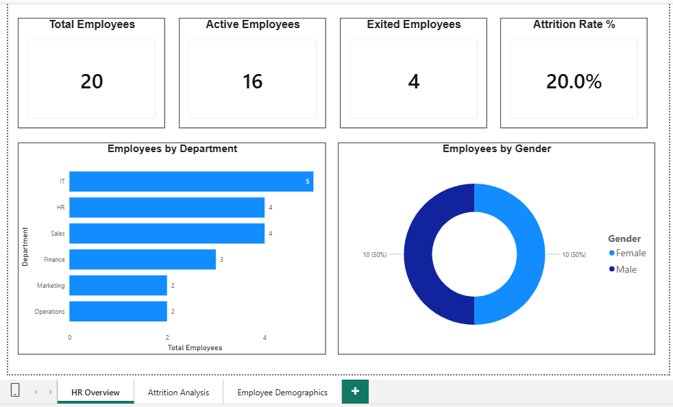
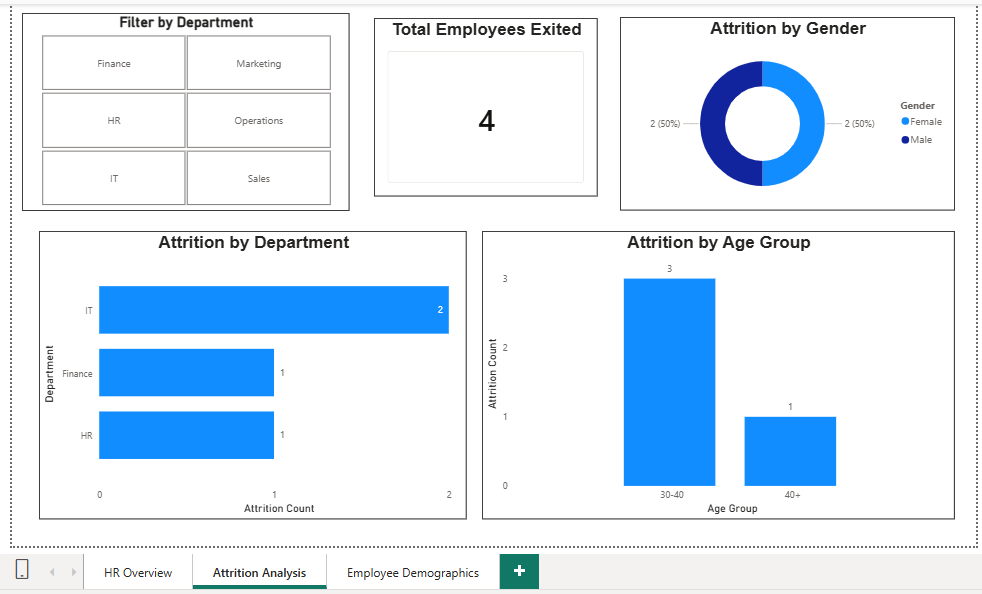
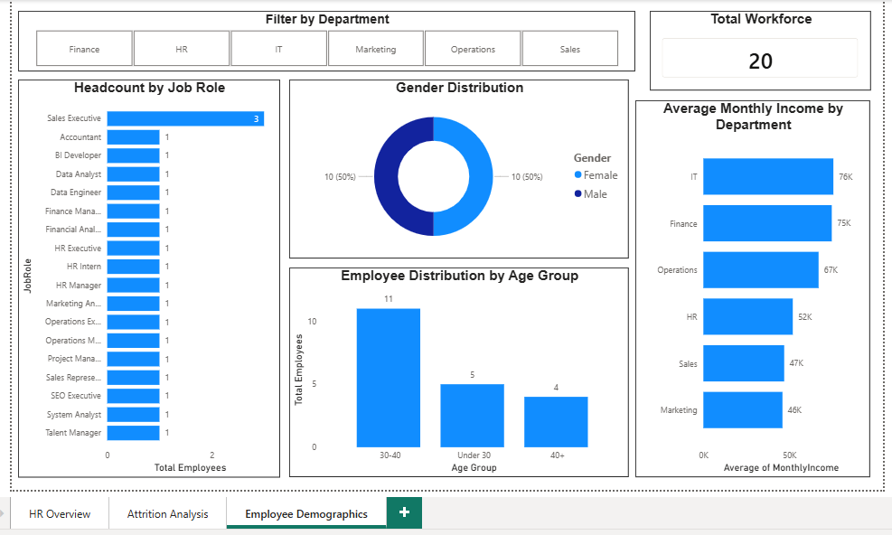

# HR Analytics Dashboard | Power BI

## 📌 Overview
3-page HR Analytics Dashboard created using Power BI to analyze workforce data and attrition trends.

---

## 📊 Dashboard – Overview Page

---

## 📉 Dashboard – Attrition Analysis

---

## 👥 Dashboard – Employee Demographics

---

## 🛠 Tools & Skills Used
- Power BI
- DAX
- Data Modeling
- Data Cleaning
- Interactive Slicers

---

## 🎯 Business Use Case
Helps HR teams:
- Identify attrition-prone departments
- Understand employee demographics
- Support workforce planning decisions

---

## 👤 Author
Ajay Thakur
